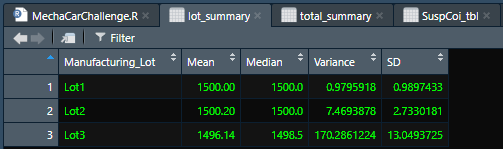
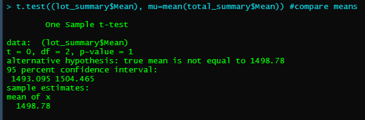
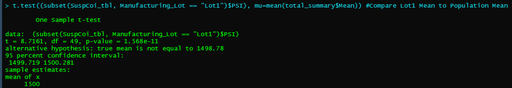
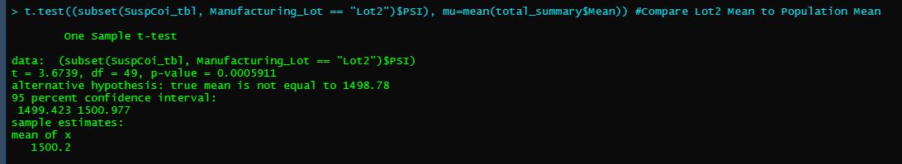
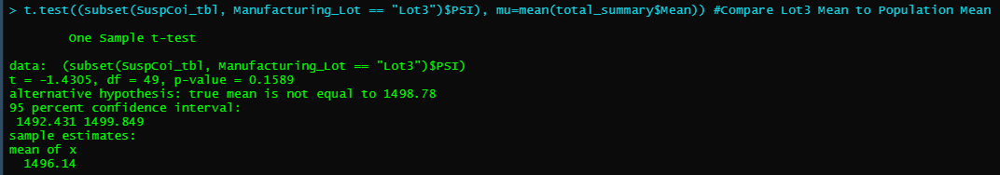

# MechaCar_Statistical_Analysis

## Linear Regression to Predict MPG  
### Variables Providing Non-random Variance to MPG Values  
* Length (p-value 2.60e-12)  
* Ground Clearance (p-value 5.21e-08)  

### Slope of Multiple Linear Regression  
* The slope of the multiple linear regression would be non-zero as the p-value is significantly smaller than .05.  The p-value is 5.35e-11, or 0.00000000000535.

### Prediction
This regression model is able to predict mpg of MechaCar prototypes effectively.  The overall p-value is significantly smaller than .05, indicating a definite slope to the linear model, and the r-squared value is .71, indicating a strong correlation.  In other words, 71% of the variability in mpg values can be attributed to the six variables analyzed.

## Summary Statistics on Suspension Coils

As a whole, the variance of suspension coils does not exceed 100 psi.  

  

however, while lot 1 and lot 2 are well within the 100 psi requirement, lot 3 exceeds by over 70 psi.  Lot 3 should be more closely evaluated to determine the reason for exceeding the 100 psi variance threshold.

  

## T-Tests on Suspension Coils
* When evaluating p-value of a t-test of all lots to the population data, as expected, the p value is 1.  This is because the two means are identical and ultimately contain the exact same data.  

  

* With Lot1, the p-value is 1.568e-11, or significantly less than the .05 threshold.  Therefore, we reject the null hypothesis and conclude that the two means are not statistically similar.  

  

* With Lot2, the p-value is 0.005911; still less than a standard .05 significance level.  Therefore, we reject the null hypothesis and conclued that the two means are not statistically similar.  

  

* However, with Lot3, the p-value is 0.1589; higher than a standard .05 significance leve.  We accept the null hypothesis and conclude that the means are statistically similar.  Important to note, considering the relatively higher variance in PSI measurements in lot 3.  

  

## Study Design: MechaCar vs Competition

With rising gasoline prices, climate change concerns, and city fuel economy being the lower of the two fuel economy ratings, I would make the assumption that consumers will be more conscious about city fuel economy ratings.  

I would recommend a two-way ANOVA test for city mpg based on brand (MechaCar or Competition) and vehicle class as this is the best test to compare the mean values of miles per gallon across multiple groups.  The null hypothesis:  The means of all groups are equal, or µ1 = µ2 = … = µn.  The data requied for MechaCar is already accessible; I would research if EPA or possibly NTSB fuel economy data is publicly available for the competition for this test.  
